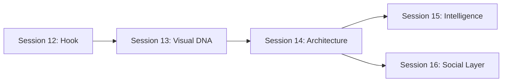

# Product "Wow" Plan v2 — DRepScore

> From comprehensive governance tool to the app that makes the entire crypto space say "wow." Sessions 12-16 transform the product through emotional design, visual identity, architecture, intelligence, and social mechanics.

**Created:** March 2, 2026
**Predecessors:** `product-wow-plan.md` (Sessions 1-7), `product-wow-plan-v1.5.md` (Sessions 8-11)
**Context:** Deep product/UX critique after completing all v1 and v1.5 work, including sync pipeline hardening. See agent transcript for the raw analysis.

---

## Table of Contents

1. [The Gap](#the-gap-impressive-tool-vs-transcendent-product)
2. [Design Philosophy for v2](#design-philosophy-for-v2)
3. [Current State Summary](#current-state-summary)
4. [Session 12 — The 10-Second Hook](#session-12--the-10-second-hook)
5. [Session 13 — DRep Identity System & Visual Signature](#session-13--drep-identity-system--visual-signature)
6. [Session 14 — Experience Architecture Overhaul](#session-14--experience-architecture-overhaul)
7. [Session 15 — Governance Intelligence Engine](#session-15--governance-intelligence-engine)
8. [Session 16 — The Live Social Layer](#session-16--the-live-social-layer)
9. [Execution Order](#execution-order-and-dependencies)
10. [Anti-Patterns](#anti-patterns)
11. [Deferred Items](#deferred-items)

---

## The Gap: Impressive Tool vs. Transcendent Product

Sessions 1-11 built an extraordinary feature set: 60+ API routes, 80+ components, 4-pillar scoring model, treasury intelligence with counterfactual analysis, representation matching from real votes, governance DNA quiz, multi-channel notifications (push, email, Discord, Telegram), gamification for both DReps and delegators, and Observable analytics dashboards. The engineering is world-class.

But the product still presents as an **analyst's tool wearing a nice coat of paint**. Three fundamental gaps prevent the "wow":

### 1. No Emotional Hook

The first 10 seconds are informational, not personal. The homepage shows "17.2B ADA is being governed right now" — factually impressive but emotionally empty. There's no personal connection. No one sees this and thinks "I need to act." The authenticated homepage shows skeleton loaders while client-fetching data. Compare to Credit Karma's breakthrough: "See your score." One screen, one number, immediate personal relevance.

### 2. No Visual Signature

Screenshots are indistinguishable from thousands of shadcn-based Next.js apps. The ScoreRing is a standard donut chart. The pillar bars are basic progress bars. The ActivityHeatmap is a GitHub clone. There is no single visual element that, when screenshotted, is instantly and unmistakably "DRepScore." The v1 plan called for a "signature governance constellation" — it was never built. The Governance Identity Radar (6-dimension alignment visualization) was identified in Session 11 as "Build now, lowest complexity, highest visual impact" — also never built.

### 3. Data Without Narrative

Every page shows numbers but no page tells a story. The DRep profile is 8 sections stacked vertically. The dashboard is 15+. The governance page is a wall of cards. Each piece is well-built in isolation; together they create cognitive overload. No page answers its core question in the first viewport. No page creates an emotional reaction.

---

## Design Philosophy for v2

These principles supersede all prior design guidance:

- **One-viewport answers.** Every page must answer its core question in the first viewport. Everything else is progressive depth.
- **Emotion before information.** The user should *feel* something before they *read* something. Pride, urgency, curiosity, surprise — design for the feeling first.
- **Dark mode is the hero.** Crypto users overwhelmingly prefer dark mode. Design dark-first, validate light mode second.
- **Speed is a feature.** Every interaction must feel instant. If data takes time, the UI must feel alive while waiting — not empty.
- **Every surface is shareable.** If it can't be screenshotted and look beautiful in a tweet, it's not done.
- **Progressive complexity, not progressive disclosure.** Don't hide complexity — reveal it through narrative. "Your DRep scored 72 — here's what that means" is better than hiding the breakdown behind a toggle.

---

## Current State Summary

This section provides the baseline for any agent picking up a session. All of this was built in Sessions 1-11.

### Routes

| Route | Purpose |
|-------|---------|
| `/` | Dual-mode homepage: `ConstellationHero` (R3F WebGL constellation + text overlay + `ActivityTicker`) + `PersonalGovernanceCard` (segment-aware: delegated/undelegated/drep, below hero) + `HowItWorksV2` (SVG micro-vignettes) + `DRepDiscoveryPreview` (with identity color accents). Auth via httpOnly cookie — no skeleton flash. Old components (`GovernancePulseHero`, `HomepageAuth`, `HomepageUnauth`, `DashboardPreview`) are no longer in the render path. |
| `/discover` | DRep discovery — card/table toggle, Governance DNA Quiz, smart search, infinite scroll |
| `/drep/[drepId]` | DRep profile — ScoreCard, milestones, score history, treasury stance, philosophy, heatmap, about, voting history (8 sections, linear stack) |
| `/proposals` | Proposal list with status tabs, type/sort filters |
| `/proposals/[txHash]/[index]` | Proposal detail — voters, timeline, sentiment poll, financial impact, accountability |
| `/pulse` | Governance Pulse — stats, leaderboard, movers, Hall of Fame, treasury health widget |
| `/treasury` | Treasury dashboard — health score, charts, What-If simulator, accountability polls |
| `/governance` | My Governance — delegation health, representation, calendar, citizen section (auth-gated) |
| `/compare` | Side-by-side DRep comparison — radar (pillars), trends, vote overlap |
| `/dashboard` | DRep Command Center — score, inbox, recommendations, competitive context, simulator, delegator analytics, milestones, philosophy, report card (15+ sections) |
| `/claim/[drepId]` | Claim DRep profile — FOMO-driven with governance pulse stats |
| `/profile` | User profile — prefs, watchlist, notifications |

### Navigation (Header)

Desktop: Proposals | Discover | Pulse | Treasury | My Governance (auth) | Dashboard (DRep) — 4-6 items.
Mobile: Hamburger sheet with same items + wallet connect.

### Data Architecture

- **Source:** Koios API (Cardano chain data) → Inngest cron functions → Supabase (Postgres)
- **Sync cadence:** Proposals every 30 min, DReps/votes/secondary every 6h, slow daily, treasury daily
- **Self-healing:** `sync-freshness-guard` retriggers stale syncs every 30 min
- **Scoring:** 4-pillar model — Rationale (35%), Effective Participation (30%), Reliability (20%), Profile (15%)
- **Alignment:** 6 dimensions stored on every DRep: `alignment_treasury_conservative`, `alignment_treasury_growth`, `alignment_decentralization`, `alignment_security`, `alignment_innovation`, `alignment_transparency` (0-100 each)
- **AI:** Anthropic Claude (sonnet) for proposal summaries, rationale summaries, rationale draft generation
- **Notifications:** Unified engine with push, email (Resend), Discord, Telegram channels
- **Analytics:** PostHog (client + server), Observable Framework dashboards

### Visual System

- **Stack:** Tailwind v4, shadcn/ui, Recharts, Lucide icons
- **Fonts:** Geist Sans + Geist Mono
- **Theme:** oklch color system — light (Cypherpunk: deep tech blue, electric purple, neon cyan) / dark (soft emerald, soft purple). Dark mode is the default for all visitors (set in Session 12).
- **Homepage hero:** React Three Fiber WebGL constellation with `@react-three/postprocessing` Bloom (mipmapBlur). Instanced nodes, batched lineSegments, ambient starfield, adaptive quality via GPU tier detection. `next/dynamic` with `ssr: false` — zero LCP impact (~200KB lazy-loaded).
- **Activity ticker:** Bloomberg-style scrolling horizontal feed of recent governance actions (`ActivityTicker` component, `/api/governance/activity` API route).
- **DRep identity colors:** `lib/drepIdentity.ts` maps 6 alignment dimensions to identity colors (Treasury Conservative = Deep Red, Treasury Growth = Emerald, Decentralization = Purple, Security = Amber, Innovation = Cyan, Transparency = Blue). Used by the constellation, and shared foundation for Session 13.
- **Animations:** CSS (`animate-fade-in-up`, `animate-gradient-shift`, card hover lift, button press scale, `animate-cta-pulse`, `ticker-scroll`) + R3F `useFrame` for continuous 3D animation.
- **Score visualization:** `ScoreRing` (standard donut chart)
- **Charts:** Recharts with default styling, some custom tooltips

### Key Gaps From Sessions 1-11 (NOT Built)

| Item | Status | Session Origin |
|------|--------|---------------|
| Governance Identity Radar (6-dim alignment radar chart) | **Not built** | Session 11 |
| Cross-Proposal Intelligence (macro governance patterns) | **Not built** | Session 11 |
| DelegationChangeCard (epoch-level delegator gain/loss) | **Not built** | Session 11 |
| Signature visual element / governance constellation | **Built (Session 12)** — R3F WebGL constellation with bloom, Cardano starburst layout | Session 6 |
| Page transitions (View Transitions API) | **Deferred** | Session 6 |
| Custom iconography | **Deferred** | Session 6 |

---

## Session 12 — The 10-Second Hook

### Thesis

The homepage is the highest-leverage surface in the product. The rewrite makes the first 10 seconds personal, urgent, and impossible to ignore — anchored by a full-bleed WebGL governance constellation.

### What Was Built

**1. Full-bleed ConstellationHero with R3F governance constellation.** Originally built with Canvas 2D, then upgraded to React Three Fiber (Three.js) with real WebGL bloom in a cleanup pass. The constellation visualizes 200-800 DRep nodes (adaptive by GPU tier) in a Cardano-logo-inspired 6-arm radial starburst layout. Each arm represents one alignment dimension, with DReps colored by their dominant identity color. Ambient starfield for depth. Bloom post-processing (`mipmapBlur`) for cinematic glow. `CameraControls` for smooth fly-to animations on wallet connect.

**2. ActivityTicker — Bloomberg-style scrolling governance feed.** Horizontal continuously scrolling ticker showing recent votes, delegations, rationale publications, and proposals. Data from `/api/governance/activity`. Ticker speed is dynamic based on event count (~2s per event). Connects to constellation — ticker events pulse the corresponding DRep node.

**3. Segment-aware PersonalGovernanceCard.** Three variants:
- **Delegated**: DRep name, score, trend, representation match, open proposals, epoch countdown
- **Undelegated**: FOMO-driven "Your ADA is unrepresented" with governance stats
- **DRep**: Score, rank, delegator count, pending proposals
Rendered below the hero in normal document flow to prevent ticker overlap.

**4. SSR auth via httpOnly cookie.** Dual-write session management: `localStorage` + `httpOnly secure sameSite:lax` cookie. Server component reads cookie via `cookies()` API for pre-rendered authenticated content — no skeleton flash for returning users.

**5. HowItWorksV2 with SVG micro-vignettes.** Three-step visual explanation replacing the text-heavy v1.

**6. `lib/drepIdentity.ts` — 6-dimension identity color system.** Maps `AlignmentDimension` types to `IdentityColor` (hex, RGB, label). Utilities: `getDominantDimension()`, `getIdentityColor()`, `extractAlignments()`, `alignmentsToArray()`. Shared foundation for Session 13.

**7. `lib/constellation/layout.ts` — Cardano-logo starburst layout.** 6-arm radial layout with angular fanning (45-degree arc per arm). Force-directed positioning: specialists drift outward, generalists cluster near center. Z-axis depth variation for parallax. Outputs 3D `[x, y, z]` coordinates ready for `InstancedMesh`.

**8. Dark mode as default theme.** Set in `app/layout.tsx` via `defaultTheme="dark"`.

### What Changed in Cleanup (Session 12.5)

- Canvas 2D replaced with React Three Fiber (real WebGL bloom, GPU instancing, cinematic camera)
- Push notification modal deferred on homepage (no longer blocks constellation animation)
- Wallet disconnect properly resets hero state and camera position
- PersonalGovernanceCard moved below hero into normal flow (no more ticker overlap)
- Ticker speed doubled (from `4s/event` to `2s/event`)
- Dead Canvas 2D files deleted (`renderer.ts`, `engine.ts`)

### Current State (for agent context)

- `components/GovernanceConstellation.tsx` — R3F `<Canvas>` with `Instances` (nodes), `lineSegments` (edges), `AmbientStarfield`, `EffectComposer` + `Bloom`, `CameraControls`
- `components/ConstellationHero.tsx` — Orchestrates constellation, headline overlay, ticker, and card data callback
- `components/HomepageDualMode.tsx` — Entry point: `ConstellationHero` + `PersonalGovernanceCard` (below hero) + `HowItWorksV2` + `DRepDiscoveryPreview`
- `components/ActivityTicker.tsx` — Horizontal scrolling governance feed
- `components/PersonalGovernanceCard.tsx` — Three-variant governance summary card
- `lib/constellation/layout.ts` — 3D starburst layout
- `lib/constellation/types.ts` — R3F-oriented interfaces (`ConstellationNode3D`, `ConstellationEdge3D`, `FindMeTarget`, etc.)
- `lib/drepIdentity.ts` — Identity color system (6 dimensions)
- `app/page.tsx` — Server component with `force-dynamic`, reads auth cookie, fetches pulse data + top DReps + holder data
- `app/api/governance/constellation/route.ts` — Returns node data for constellation
- `app/api/governance/activity/route.ts` — Returns recent governance events for ticker

### Success Criteria

- Time from landing to "I understand what this is and why I should care" < 5 seconds
- Time from wallet connect to personal governance data visible < 3 seconds (SSR, no client fetch)
- Activity feed creates the sensation of a live platform, not a static report
- Constellation creates visual awe — unmistakably "DRepScore"

### Risks

- Three.js bundle size (~200KB gzipped) — fully lazy-loaded via `next/dynamic` with `ssr: false`, zero LCP impact
- WebGL compatibility on older mobile devices — adaptive quality via GPU tier detection (bloom disabled on weak hardware)
- Constellation API response time with 800+ nodes — monitor and optimize if needed

---

## Session 13 — DRep Identity System & Visual Signature

### Thesis

The single biggest gap between "good app" and "wow" is visual identity. DRepScore screenshots look like any well-built shadcn app. The Governance Identity Radar — a 6-dimension radar visualization of each DRep's governance personality — becomes the signature visual of the entire platform. Combined with a hexagonal score display and per-DRep identity colors, every DRep gets a unique visual "face" generated from their governance data.

### What Changes

**1. Governance Identity Radar.** Recharts `RadarChart` showing the 6 alignment dimensions already stored on every DRep (treasury conservative, treasury growth, decentralization, security, innovation, transparency). Appears on: DRep profiles (hero), discovery cards (mini 48x48), quick view, compare page (overlaid), report cards, OG images, badge embeds. Styled with DRep's dominant identity color.

**2. DRep identity color system extension.** Extend the existing `lib/drepIdentity.ts` (created in Session 12) with hex score mapping and radar configuration. The 6 identity colors are already defined: Treasury Conservative = Deep Red, Treasury Growth = Emerald, Decentralization = Purple, Security = Amber, Innovation = Cyan, Transparency = Blue. Session 13 adds: color as accent ring on score, gradient on profile header, radar fill, OG tint.

**3. Hexagonal score visualization.** Replace the standard `ScoreRing` donut with a hexagonal shape where 6 sides map to 6 alignment dimensions. The shape morphs based on alignment balance — well-rounded DReps have regular hexagons, specialists have asymmetric ones. This becomes the "logo" of every DRep.

**4. Framer Motion animation system.** Replace CSS-only animations with physics-based Framer Motion: staggered section reveals, spring-physics score counting, radar dimensions animating outward from center, spring-physics card hover. New dependency: `framer-motion`. New shared variants: `lib/animations.ts`.

**5. Custom chart aesthetic.** All Recharts instances get branded styling: dotted grids, dark tooltips with brand accent, gradient area fills, consistent color palette. New shared config: `lib/chartTheme.ts`.

**6. Dark-first design audit.** Polish dark mode: vivid hero gradients, verified chart contrast, subtle card glow borders, vivid score colors against dark backgrounds. Note: dark mode is already the default (set in Session 12 via `app/layout.tsx` `defaultTheme="dark"`).

**7. OG images with radar.** New route `/api/og/governance-identity/[drepId]`. Update existing `/api/og/drep/[drepId]` and `/api/og/compare` to include mini radars.

### Current State (for agent context)

- `EnrichedDRep` interface has all 6 `alignment*` fields (nullable numbers, 0-100)
- `lib/alignment.ts` — `computeAllCategoryScores()` computes all 6, `getDRepTraitTags()` generates text labels
- `lib/drepIdentity.ts` — **Already exists** (created in Session 12) with 6 identity colors, `getDominantDimension()`, `getIdentityColor()`, `extractAlignments()`, `alignmentsToArray()`, `getDimensionLabel()`, `getDimensionOrder()`, `getAllIdentityColors()`. Session 13 extends this with hex score mapping and radar configuration.
- `components/ScoreRing.tsx` — Standard SVG donut chart, color by score tier
- `components/CompareView.tsx` — Has a Recharts RadarChart for *pillars* (not alignment); alignment shown as horizontal bars
- Current animations: CSS (`animate-fade-in-up`, `animate-gradient-shift`, `animate-grow`, card hover via Tailwind transitions) + R3F `useFrame` on homepage constellation
- Decentralization score is discrete (5 possible values based on size tier) — may need normalization for radar visual balance
- Dark mode is already the default (Session 12)

### Success Criteria

- A screenshot of any DRep's profile is instantly recognizable as DRepScore
- DReps share their Governance Identity Radar on X/Twitter as their "governance personality"
- Dark mode looks intentional and premium, not auto-generated
- Animations feel fast and purposeful (200-300ms), never slow or gratuitous

### Risks

- Alignment score clustering: if most DReps have similar radar shapes, the visual loses its power. Verify score distribution before shipping; consider normalization.
- Framer Motion bundle size (~30KB gzipped). Mitigate with dynamic imports for heavy animation components.
- Hexagonal score is a custom SVG — needs to work at all sizes (16px badge through 120px profile hero)

---

## Session 14 — Experience Architecture Overhaul

### Thesis

Every major page stacks sections vertically in a linear scroll. The DRep profile is 8 sections. The dashboard is 15+. The governance page is 10+ cards. This creates cognitive overload and makes every page feel the same. This session establishes the "one-viewport answer" principle: every page answers its core question in the first viewport, with everything else organized as tabs or progressive depth.

### What Changes

**1. DRep profile page redesign.** Current: 8 sections stacked (ScoreCard → Milestones → ScoreHistory → TreasuryStance → Philosophy → Heatmap → About → VotingHistory). New: Hero viewport with Name + HexScore + Radar + identity label + key stats + Delegate/Compare CTAs, followed by tabbed depth ("Voting Record" / "Score Analysis" / "Treasury" / "About").

**2. DRep Dashboard density reduction.** Current: 15+ sections in hero + 2-column layout. New: Executive summary card (score, rank, trend, delegators, open proposals) + three-tab layout ("Inbox & Actions" / "Performance" / "Delegators") + sidebar for onboarding, profile health, share tools.

**3. Navigation simplification.** Current: 4-6 nav items (Proposals, Discover, Pulse, Treasury, My Governance, Dashboard). New: Discover + Governance (umbrella hub with sub-nav: Proposals | Pulse | Treasury | Calendar) + My Governance (auth) + Dashboard (DRep). Result: 2-4 items depending on auth state.

**4. Proposals as a feed.** Current: flat list with status tabs. New: prominence-ranked feed — critical proposals pinned, each card shows type badge + title + AI summary inline + vote progress bar + community sentiment + time remaining + "Your DRep's vote" badge.

**5. Mobile-first layout pass.** Bottom navigation bar on mobile for primary actions (Discover / Governance / My Gov). Hamburger for secondary items. Touch targets minimum 44px. Tabs horizontal-scroll on mobile.

**6. Performance.** Server-render auth homepage governance summary (kill client fetch). Server-render pulse stats. Suspense boundaries with content-aware fallbacks. Lazy-load below-fold content.

### Current State (for agent context)

- `app/drep/[drepId]/page.tsx` — Server component, 8 sections rendered linearly, all data fetched server-side
- `app/dashboard/page.tsx` — Score hero + inbox + onboarding + 2-column layout (left: DRepDashboard, ScoreSimulator, ScoreHistory; right: CompetitiveContext, RepScorecard, DelegatorTrend, Heatmap, Milestones, ProfileHealth) + bottom (Philosophy, WrappedShareCard, BadgeEmbed)
- `components/Header.tsx` — Nav items: Proposals, Discover, Pulse, Treasury + conditional My Governance, Dashboard
- `components/MobileNav.tsx` — Right-side Sheet, same items
- `app/proposals/page.tsx` — SSR proposals list, `ProposalsPageClient` handles tabs/filters
- `app/governance/page.tsx` — GovernanceDashboard + GovernanceCalendar + GovernanceCitizenSection
- shadcn `Tabs` component available; already used in Treasury (Overview/Simulator/Accountability)

### Success Criteria

- DRep profile answers "should I delegate to this person?" in the first viewport
- Dashboard answers "what do I need to do right now?" in the first viewport
- Navigation has 3-4 items max
- Mobile experience feels app-native (bottom nav, touch targets, single-column)
- Auth homepage renders server-side (no skeleton flash)

### Risks

- Navigation restructure changes URL structure — need redirects from old routes if `/pulse` and `/treasury` become sub-routes of `/governance`
- Tabbed DRep profile changes how deep-linking to sections works (need hash or query-param based tab selection)
- Bottom mobile nav z-index must layer correctly with existing sheets and modals

---

## Session 15 — Governance Intelligence Engine

### Thesis

DRepScore has all the data to generate insights nobody else in crypto can create. Currently that data is presented as individual metrics on individual pages. This session transforms raw data into narrative intelligence — macro patterns, ecosystem health scoring, AI-powered explanations, and a canonical "State of Governance" report that becomes the source crypto media and researchers cite.

### What Changes

**1. Cross-Proposal Intelligence.** Macro-level governance pattern analysis: "DReps who provide rationale are X times more likely to vote No," "Treasury proposals pass at Y% but have only Z% community support," "The top 10 DReps by score agree on Z% of votes." New library `lib/proposalIntelligence.ts` querying existing tables. New component `CrossProposalInsights.tsx` with trend indicators and per-insight share buttons.

**2. Governance Health Index (GHI).** A single 0-100 number for ecosystem health — the crypto equivalent of the Fear & Greed Index. Components: Participation Rate (25%), Rationale Rate (20%), Delegation Concentration / Gini (15%), Proposal Throughput (15%), Representation Alignment (15%), DRep Diversity (10%). Displayed as a large number with gauge, color-coded (Critical/Fair/Good/Strong), with trend sparkline. Placement: Pulse hero, homepage stat strip, treasury page, shareable card. OG image: `/api/og/governance-health`.

**3. AI proposal explainer.** Upgrade from 160-char summaries to full 3-paragraph explanations via on-demand Claude call: what it does (plain English), why it matters (financial/governance impact), key considerations (for/against). Cached in `proposals.meta_json`. New route: `/api/proposals/explain`.

**4. "State of Governance" weekly report.** Auto-generated epoch-level report: GHI score + trend, key metrics, top 3 cross-proposal insights, proposal outcomes, DRep leaderboard movers, community vs DRep sentiment, treasury update. Published to `/pulse/report/[epoch]` (public, SEO-indexed). Delivered via governance brief email + in-app card. This becomes the artifact that Cardano forums, X/Twitter, and media link to.

**5. Cross-chain governance benchmarking.** Section comparing Cardano governance to Ethereum (Tally), Polkadot (OpenGov), Cosmos (Mintscan): participation rates, delegate counts, proposal throughput. Initially static/manually maintained data in a `governance_benchmarks` table. Positions DRepScore as THE governance platform, not just a Cardano tool.

**6. Enhanced AI governance brief.** Upgrade `lib/governanceBrief.ts` from template-based to Claude-narrated: same data context, AI generates a warm 200-word narrative including cross-proposal insights and GHI change. Budget control via cached shared insights.

### Current State (for agent context)

- AI integration: `@anthropic-ai/sdk`, `claude-sonnet-4-5` for summaries, `claude-sonnet-4-20250514` for drafts
- `lib/governanceBrief.ts` — Template-based brief assembly + generation, stores in `governance_briefs` table
- `inngest/functions/generate-governance-brief.ts` — Weekly cron (Monday 10:00 UTC), batched per-user
- Existing data for cross-proposal analysis: `proposals`, `drep_votes`, `poll_responses`, `vote_rationales`, `drep_score_history` tables
- `app/pulse/page.tsx` — Client-side fetches, shows stats, leaderboard, movers, Hall of Fame
- No cross-chain data exists currently (Koios is Cardano-only)
- v1 API route `/api/v1/governance/health` returns aggregate stats already

### Success Criteria

- GHI gets shared on X/Twitter as "the number" for Cardano governance health
- "State of Governance" report becomes the most-linked DRepScore URL within 2 months
- Cross-proposal insights generate social media discussion
- At least one media outlet or researcher cites DRepScore data within 3 months
- Cross-chain benchmarking makes non-Cardano users aware of DRepScore

### Risks

- AI API costs: briefs generate per-user content. Template + AI polish controls cost. Monitor token usage.
- Cross-chain data freshness: manual maintenance is labor-intensive. Start static, automate later.
- GHI component weights are opinionated — be transparent about methodology, publish it.
- "State of Governance" quality must be high enough for media citation — AI hallucination guardrails critical.

---

## Session 16 — The Live Social Layer

### Thesis

DRepScore is a read-only analytical tool where all communication is one-directional. Governance is inherently social — debate, deliberation, persuasion, collective decision-making. This session adds the social dimension that transforms DRepScore from a tool you check into a platform you participate in.

### What Changes

**1. Unified governance activity feed (platform-wide).** Extend the Session 12 `ActivityTicker` component and `/api/governance/activity` API route from homepage-only to platform-wide: governance hub, sidebar widget. Add event types beyond the current set: score changes (significant), delegation shifts, proposal outcomes, poll results. Smart polling: refresh every 60s on active pages, pause when tab hidden.

**2. Social proof elements.** Subtle indicators: "Viewed by X people this week" on DRep profiles (from `views` table), "X delegators have polled on this" on proposals (from `poll_responses`), "You're one of Z active governance participants this epoch" on dashboards. Cached counts, not real-time.

**3. DRep-delegator communication channel.** Extend `DRepCommunicationFeed` (currently one-way: explanations, positions, philosophy) with two-way Q&A: delegators submit questions (500 char, rate-limited), DReps reply via dashboard inbox, all communication is public. New tables: `drep_questions`, `drep_responses`.

**4. Enhanced sharing infrastructure.** Make sharing organic, not mechanical: "Governance DNA card" auto-generated after significant actions (shows radar + level + stats), "State of Governance" shareable cards (GHI + key insight), DRep comparison cards (both radars), in-context share prompts after key moments (delegation, quiz, level-up) — subtle, not modal. Note: `ConstellationHero` already has segment-aware wallet-connect animation moments that "in-context share prompts after key moments" builds on.

**5. Developer experience for v1 API.** New `/developers` page: interactive API explorer, code examples (JS, Python, cURL), embed widget generator, use cases. API keys for Pro tier (manual approval initially). Rate limits: 100/min public, 1000/min Pro. Every Cardano dApp that integrates becomes a distribution channel.

**6. Governance achievement NFTs (stretch goal).** Milestone badges as on-chain CIP-25 NFTs: mint when DRep achieves a milestone, NFT image features the milestone badge with governance identity radar. Builds minting transaction via MeshSDK. Only build if Sessions 12-15 ship cleanly.

### Current State (for agent context)

- `components/DRepCommunicationFeed.tsx` — Shows one-way feed (explanations, positions, philosophy) from `/api/governance/drep-feed`
- `components/ActivityTicker.tsx` — Built in Session 12, horizontal scrolling governance feed on homepage. Session 16 extends platform-wide.
- Profile views tracked in `views` table, `components/ProfileViewStats.tsx` exists
- v1 API: 7 routes (`/api/v1/dreps`, `/api/v1/dreps/[drepId]`, `/api/v1/dreps/[drepId]/votes`, `/api/v1/dreps/[drepId]/history`, `/api/v1/proposals`, `/api/v1/embed/[drepId]`, `/api/v1/governance/health`)
- Share infrastructure: 13 OG image routes, `ShareActions` component, `WrappedShareCard`, `DelegatorShareCard`, `DRepReportCard`, `BadgeEmbed`
- MeshSDK already integrated for delegation transactions
- Milestone system: `lib/milestones.ts` (9 milestones), `drep_milestones` table, `MilestoneBadges` component

### Success Criteria

- Activity feed makes the platform feel alive ("active" not "static")
- At least 10 delegator-DRep question exchanges within first month
- `/developers` page drives at least 3 external integrations within 3 months
- Governance DNA cards become a social media trend within Cardano community

### Risks

- DRep-delegator Q&A requires moderation strategy — public communication can attract spam/abuse
- NFT minting adds on-chain transaction complexity and potential wallet UX issues
- API rate limiting needs middleware — consider existing solutions (Upstash Redis)
- Social proof numbers may be low initially — consider minimum thresholds before displaying

---

## Execution Order and Dependencies

- **Session 12** ships first — it's the front door. Everything else is less impactful if the first impression doesn't convert.
- **Session 13** ships before 14 because the visual identity (radar, hex score, identity colors) is used in the architecture redesign.
- **Session 14** establishes the layout framework that Sessions 15 and 16 content lives within.
- **Sessions 15 and 16** can be parallelized or sequenced in either order.

Each session gets its own worktree (`drepscore-<session-name>`) and detailed implementation plan (`.cursor/plans/<session>.plan.md`) before building begins.

---

## Anti-Patterns

In addition to all anti-patterns from v1 and v1.5:

1. **Don't add more sections to already-long pages.** The goal is to REDUCE information density, not add to it. New features go into existing tab structures, not as new vertical sections.
2. **Don't animate for animation's sake.** Every Framer Motion animation must serve a purpose: guide attention, confirm action, or create delight. If removing the animation wouldn't lose meaning, remove it.
3. **Don't optimize for power users first.** The homepage, DRep profiles, and proposals page must work for someone who has never heard of Cardano governance. Power-user features go in tabs, not heroes.
4. **Don't ship without dark mode testing.** Every component must look intentional in dark mode. No washed-out gradients, no invisible borders, no illegible chart labels.
5. **Don't break URLs.** If navigation restructuring moves pages, add redirects. External links to DRep profiles and proposals must never 404.
6. **Don't let AI hallucinate governance data.** Cross-proposal insights and State of Governance reports must validate facts against source data. Never let AI generate statistics — compute them, then let AI narrate them.

---

## Deferred Items

| Item | Rationale |
|------|-----------|
| On-chain rationale/voting submission | Monitor GovTool usage patterns first. If DReps consistently draft in DRepScore then context-switch to GovTool, demand signal is clear. |
| AI score coach chatbot | Score Simulator + AI brief cover the "how do I improve" use case. Revisit when demand signal emerges. |
| Proposal discussion threads | Q&A channel in Session 16 is the lightweight version. Full threading has high moderation overhead. |
| Multi-DRep team dashboard | Very few organizations run team DReps. Revisit when demand signals emerge. |
| View Transitions API | Browser support still experimental in 2026. Framer Motion (Session 13) covers animation needs. |
| Custom iconography | Lucide is high quality and consistent. Custom icons require a designer. |
| Sound design | Potential polish item after Sessions 12-16 ship. |
| Internationalization | Important but separate workstream — doesn't affect the "wow" factor for English-speaking crypto audience. |
